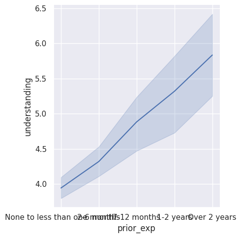
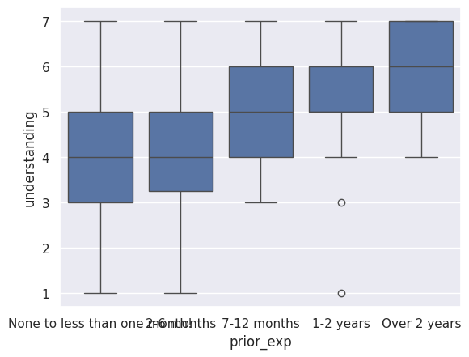

---
# Do not edit the text between these lines!
layout: default
---

# How does Prior Coding Experience influence overall Understanding in COMP110?

<!-- This is a comment. Below, you'll see code for inserting an image. To make this image appear, update <custom-path>. To add an image, save it inside the imgs folder of this repository. -->
/static/imgs/logo.png" alt="Image of Comp110 rainbow logo. "  width="500"/>

## Figure 1

## This graph shows that the more prior experience in COMP SCI that you have, the more your general understanding in the class. There is a mild positive correlation.

## Figure 2

## This graph shows that most students in the class do not have any prior experience in COMP SCI which emphasizes the importance of solidifying python fundamentals to increase general understanding in the class.

## Figure 3

## This graphs shows a trend that prior experience leads to a better understanding in COMP 110. However, there is variation between answers. This means that prior experience is not the only factor that may impact overall understanding.

 
Conclusion: Based on the created visulizations, there seems to be a moderate positive relationship between prior coding experience and general understanding in COMP 110. Students that have more experience, tend to report a higher rate of understanding than those who have little to no experience. Since students who have prior experience have seen the material before and may know the basics of python, their understanding ,ay show as greater. However, there is a strong variation between all groups answers, regardless of prior experience. As shown on the boxplot, theres variation between answers in all groups. This shows while prior coding experience may help with overall understanding, this may not be the only factor that influences understanding. The data does support that prior experience is a factor that contributes to understanding in COMP 110. If in COMP 110 more time was put towards solidifying the python fundamentals, and understanding basic concepts, than overall understanding may increase. 